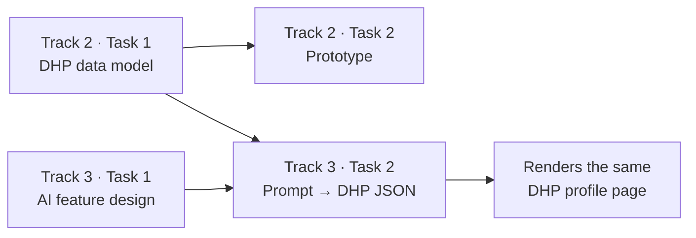

# Gradstack Internship Challenge — Submission

This repository is my response to the Gradstack take-home challenge, built around the
**Digital Human Profile™ (DHP™)** and the persona **Jordan**, a communications graduate
who has applied to 40+ roles and feels invisible in the hiring market.

The work spans two tracks:

- **Track 2 — Development** (primary): a DHP data model, a working prototype, and the reasoning behind it.
- **Track 3 — AI** (bonus): an AI feature design, a tested prompt that turns Jordan's raw notes into a structured DHP page, and the reasoning behind it.

## Live demos

| Demo | What it shows |
|---|---|
| **[Track 2 · DHP prototype](https://gradstack-track-2-task-2-prototype.vercel.app/)** | Jordan's onboarding flow and multi-page readiness dashboard (VEI, VCI, opportunity matching). |
| **[Track 3 · DHP prompt renderer](https://gradstack-track-3-task-2-prompts.vercel.app/)** | Six AI-generated DHP pages (2 models × 3 prompt tones) rendered from schema-valid JSON. |

## The throughline

Every task is connected by one idea: the DHP is a **living trust layer**, not a resume. It makes Jordan's story, skills, evidence, verification, and readiness visible — and turns that into guidance about what to do next.



The Track 3 prompt reuses the Track 2 data model and prototype as its display contract, so the AI output rebuilds the *same* DHP page rather than a generic profile.

## Repository map

### Track 2 — Development (primary)
- [`track-2-development/task-1-design-the-data-model/`](track-2-development/task-1-design-the-data-model/) — Full DHP data model: ~40 tables across account/onboarding, profile core, trust/privacy, readiness + VEI/VCI, and opportunities/applications, with an ERD, a Task 2 data-coverage map, an example JSON payload, and design trade-offs.
- [`track-2-development/task-2-build-a-component-or-prototype/`](track-2-development/task-2-build-a-component-or-prototype/) — Vanilla-JS web component: welcome → sign-up → onboarding import → multi-page readiness dashboard, with a stateful "attach evidence and watch readiness update" interaction.
- [`track-2-development/task-3-explain-your-thinking/`](track-2-development/task-3-explain-your-thinking/) — Technical decisions (single web component, state-driven render, privacy-safe verification) and what I'd do differently with a full team.

### Track 3 — AI (bonus)
- [`track-3-ai/task-1-design-an-ai-feature-for-the-dhp/`](track-3-ai/task-1-design-an-ai-feature-for-the-dhp/) — "Skills Gap and Project Pathway Builder": compares Jordan's DHP against matching job ads, prioritises missing skills, and recommends projects/tests with AI + human review before evidence is added.
- [`track-3-ai/task-2-write-and-test-a-prompt/`](track-3-ai/task-2-write-and-test-a-prompt/) — A prompt that turns Jordan's raw, messy notes into one schema-valid DHP profile JSON. Tested across 3 tones × 2 Gemini models using a LangGraph/LangChain pipeline with JSON Schema validation and an automatic repair loop. Includes the prompts, sample outputs, metrics, and a renderer.
- [`track-3-ai/task-3-explain-your-thinking/`](track-3-ai/task-3-explain-your-thinking/) — What problem the feature/prompt solves for Jordan, and the risks and limitations to know before building it.

## Running locally

### Track 2 prototype (no dependencies)
Plain HTML/CSS/JS, no build step.

- **Easiest:** open the [live demo](https://gradstack-track-2-task-2-prototype.vercel.app/).
- **Double-click:** open `track-2-development/task-2-build-a-component-or-prototype/index.html` in a browser (the script uses `defer`, not ES modules, so it runs from the file system).
- **Served:** from that folder run `python -m http.server 8000`, then open `http://localhost:8000`.

### Track 3 prompt renderer
The page loads generated JSON via `fetch`, so serve the folder over HTTP:

```bash
cd track-3-ai/task-2-write-and-test-a-prompt
python -m http.server 8010
```

Then open `http://localhost:8010` (or just use the [live demo](https://gradstack-track-3-task-2-prompts.vercel.app/)).

### Re-running the AI prompt evaluation
From `track-3-ai/task-2-write-and-test-a-prompt/`:

```bash
pip install -r scripts/requirements.txt
# copy .env.example to .env and add GOOGLE_API_KEY=...
python scripts/run_prompt_eval.py
```

See that folder's README for flags (`--dry-run`, `--provider`, `--tone`) and model configuration.

## How to read this

1. Start with the **data model** ([Track 2 · Task 1](track-2-development/task-1-design-the-data-model/)) for the structure behind the product.
2. Open the **live prototype** ([Track 2 · Task 2](https://gradstack-track-2-task-2-prototype.vercel.app/)) to see Jordan's first experience; try attaching the campaign project evidence and watch the readiness guidance update.
3. Read **Track 2 · Task 3** for the reasoning and trade-offs.
4. For the AI track, read the **feature design** ([Track 3 · Task 1](track-3-ai/task-1-design-an-ai-feature-for-the-dhp/)), then open the **prompt renderer** ([Track 3 · Task 2](https://gradstack-track-3-task-2-prompts.vercel.app/)) to compare tones and models, and finish with **Track 3 · Task 3**.
