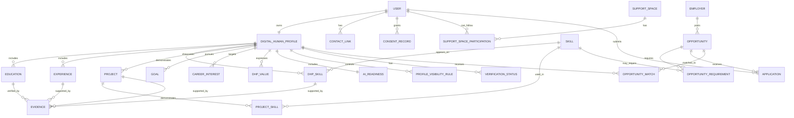

# Task 1: DHP Data Model

## Problem Framing

Gradstack's Community Hub should not store a Digital Human Profile (DHP) as a normal resume with extra fields attached. For someone like Jordan, the problem is not only that employers lack his work history. The problem is that his potential, goals, values, evidence, and readiness are hard to see in traditional hiring systems.

The DHP should therefore act as a living profile that helps a graduate become visible, trusted, and connected. It needs to store:

- the human story behind the person
- skills and projects with evidence
- goals, values, and work style
- AI readiness and confidence
- connection preferences and support activity
- privacy and consent choices
- verification status without exposing sensitive documents by default
- opportunity matching and application tracking

## Core Entity Relationship View



## Key Tables and Fields

### `users`

Stores account-level identity. This should stay separate from the DHP so the product can support privacy controls and future account features.

| Field | Type | Notes |
|---|---|---|
| `id` | UUID | Primary key |
| `email` | string | Unique login email |
| `full_name` | string | Jordan Lee |
| `phone` | string, nullable | Optional contact detail |
| `location` | string | City or region |
| `created_at` | timestamp | Account created |
| `last_active_at` | timestamp | Supports engagement and onboarding reminders |

### `contact_links`

Stores optional public or semi-public links separately from the account record so Jordan can choose what appears on his DHP.

| Field | Type | Notes |
|---|---|---|
| `id` | UUID | Primary key |
| `user_id` | UUID | Parent user |
| `link_type` | enum | `linkedin`, `portfolio`, `github`, `website`, `other` |
| `label` | string | Display label |
| `url` | string | Link target |
| `visibility` | enum | `private`, `hub`, `employers`, `public` |

### `digital_human_profiles`

The main DHP record. This is the user's human-facing profile, not just their account.

| Field | Type | Notes |
|---|---|---|
| `id` | UUID | Primary key |
| `user_id` | UUID | One profile per user in the first version |
| `headline` | string | Short profile summary |
| `personal_story` | text | Human narrative: background, motivation, journey |
| `career_summary` | text | More structured career positioning |
| `desired_roles` | string[] | Example: content coordinator, marketing assistant |
| `industries_of_interest` | string[] | Example: media, education, social impact |
| `availability` | enum | `immediate`, `two_weeks`, `part_time`, `flexible` |
| `work_style_summary` | text | How the person works best |
| `profile_completeness` | integer | 0-100 readiness/completeness indicator |
| `visibility_status` | enum | `private`, `hub`, `employers`, `public_link` |
| `updated_at` | timestamp | Shows that the DHP is living, not static |

### `career_interests`

Stores the user's target direction in a structured way so the product can match opportunities and recommend relevant support.

| Field | Type | Notes |
|---|---|---|
| `id` | UUID | Primary key |
| `dhp_id` | UUID | Parent DHP |
| `interest_type` | enum | `role`, `industry`, `work_environment`, `location`, `employment_type` |
| `name` | string | Example: content coordinator |
| `priority` | integer | 1-5 importance |
| `reason` | text | Why this interest matters to the user |

### `education`

Stores traditional education data, but can be linked to verification and evidence.

| Field | Type | Notes |
|---|---|---|
| `id` | UUID | Primary key |
| `dhp_id` | UUID | Parent DHP |
| `institution` | string | University or provider |
| `qualification` | string | Bachelor of Communications |
| `field_of_study` | string | Communications |
| `start_date` | date | Optional |
| `end_date` | date | Optional |
| `graduation_status` | enum | `completed`, `in_progress`, `deferred` |
| `description` | text | Relevant projects, majors, awards |

### `experiences`

Stores work and lived experience without treating only formal career roles as valuable.

| Field | Type | Notes |
|---|---|---|
| `id` | UUID | Primary key |
| `dhp_id` | UUID | Parent DHP |
| `title` | string | Example: casual hospitality team member |
| `organisation` | string | Employer or context |
| `experience_type` | enum | `paid_work`, `volunteering`, `internship`, `student_project`, `personal_project` |
| `start_date` | date | Optional |
| `end_date` | date, nullable | Null if current |
| `description` | text | What the person did |
| `transferable_skills` | string[] | Communication, teamwork, customer empathy |

### `skills`

The reusable skill catalogue.

| Field | Type | Notes |
|---|---|---|
| `id` | UUID | Primary key |
| `name` | string | Example: copywriting |
| `category` | enum | `technical`, `communication`, `creative`, `professional`, `ai`, `leadership` |
| `description` | text | Optional controlled definition |

### `dhp_skills`

Connects a DHP to skills and describes confidence, context, and evidence.

| Field | Type | Notes |
|---|---|---|
| `id` | UUID | Primary key |
| `dhp_id` | UUID | Parent DHP |
| `skill_id` | UUID | Linked skill |
| `proficiency_level` | enum | `learning`, `working`, `confident`, `advanced` |
| `confidence_level` | integer | 1-5 self-reported confidence |
| `context_note` | text | How the skill has been used |
| `evidence_count` | integer | Denormalised display helper |
| `is_featured` | boolean | Highlights top DHP skills |

### `projects`

Shows what the person can do, especially where formal work history is thin.

| Field | Type | Notes |
|---|---|---|
| `id` | UUID | Primary key |
| `dhp_id` | UUID | Parent DHP |
| `title` | string | Project name |
| `summary` | text | Short explanation |
| `role` | string | Jordan's contribution |
| `outcome` | text | Result, impact, or learning |
| `project_type` | enum | `university`, `personal`, `client`, `community_or_volunteer`, `work` |
| `url` | string, nullable | Portfolio, demo, writing sample |
| `start_date` | date | Optional |
| `end_date` | date | Optional |
| `is_featured` | boolean | Featured on profile card |

### `project_skills`

Many-to-many table connecting projects to demonstrated skills.

| Field | Type | Notes |
|---|---|---|
| `project_id` | UUID | Linked project |
| `skill_id` | UUID | Linked skill |
| `evidence_note` | text | How the project demonstrates this skill |

### `evidence`

Proof attached to claims. This is one of the main differences between a DHP and a resume.

| Field | Type | Notes |
|---|---|---|
| `id` | UUID | Primary key |
| `dhp_id` | UUID | Parent DHP |
| `related_entity_type` | enum | `skill`, `project`, `education`, `experience`, `ai_readiness` |
| `related_entity_id` | UUID | Points to the supported claim |
| `evidence_type` | enum | `portfolio_link`, `certificate`, `file`, `reference`, `writing_sample`, `video`, `badge` |
| `title` | string | Human-readable label |
| `url` | string | Link or secure file path |
| `description` | text | What the evidence proves |
| `verification_status` | enum | `self_added`, `pending`, `verified`, `rejected` |
| `visibility` | enum | `private`, `hub`, `employers`, `public` |
| `created_at` | timestamp | Added date |

### `goals`

Captures forward momentum, not just past experience.

| Field | Type | Notes |
|---|---|---|
| `id` | UUID | Primary key |
| `dhp_id` | UUID | Parent DHP |
| `goal_type` | enum | `role`, `skill`, `industry`, `connection`, `confidence`, `application` |
| `title` | string | Example: land a junior content role |
| `description` | text | Why this matters |
| `target_date` | date, nullable | Optional |
| `status` | enum | `active`, `paused`, `completed` |

### `dhp_values`

Captures motivations and preferred working environment.

| Field | Type | Notes |
|---|---|---|
| `id` | UUID | Primary key |
| `dhp_id` | UUID | Parent DHP |
| `name` | string | Example: creativity, inclusion, learning |
| `description` | text | What this value means to the user |
| `is_featured` | boolean | Show prominently on profile |

### `ai_readiness`

Stores how ready the user is to work with AI tools. This should not be a vague score only; it should be connected to practical use and evidence.

| Field | Type | Notes |
|---|---|---|
| `id` | UUID | Primary key |
| `dhp_id` | UUID | One readiness record per DHP |
| `comfort_level` | integer | 1-5 self-reported comfort |
| `tools_used` | string[] | Example: ChatGPT, Canva, Notion AI |
| `use_cases` | string[] | Research, drafting, editing, brainstorming |
| `ai_work_examples` | text | How AI has been used responsibly |
| `responsible_ai_confidence` | integer | 1-5 confidence around ethics and checking outputs |
| `learning_goals` | string[] | What the user wants to improve |
| `last_updated_at` | timestamp | AI readiness changes over time |

### `verification_statuses`

Stores verification results, not raw sensitive documents by default.

| Field | Type | Notes |
|---|---|---|
| `id` | UUID | Primary key |
| `dhp_id` | UUID | Parent DHP |
| `verification_type` | enum | `identity`, `working_rights`, `degree`, `licence`, `police_check` |
| `status` | enum | `not_started`, `pending`, `verified`, `expired`, `failed` |
| `provider` | string | Verification provider, if used |
| `verified_at` | timestamp, nullable | When verification passed |
| `expires_at` | timestamp, nullable | Expiry for checks/licences |
| `visibility` | enum | `private`, `employer_on_request`, `employers` |

### `profile_visibility_rules`

Gives the user control over what appears in different contexts.

| Field | Type | Notes |
|---|---|---|
| `id` | UUID | Primary key |
| `dhp_id` | UUID | Parent DHP |
| `field_group` | enum | `contact`, `story`, `skills`, `evidence`, `verification`, `applications` |
| `audience` | enum | `self`, `hub`, `verified_employers`, `specific_employer`, `public` |
| `access_level` | enum | `hidden`, `summary`, `full` |
| `updated_at` | timestamp | Audit trail |

### `consent_records`

Stores explicit permission events, especially when employers request access to private evidence or verification status.

| Field | Type | Notes |
|---|---|---|
| `id` | UUID | Primary key |
| `user_id` | UUID | User giving consent |
| `requesting_entity_type` | enum | `employer`, `support_space`, `verification_provider`, `platform` |
| `requesting_entity_id` | UUID | Who receives access |
| `scope` | string[] | Example: `verification.working_rights`, `evidence.project_links` |
| `status` | enum | `granted`, `revoked`, `expired`, `denied` |
| `granted_at` | timestamp, nullable | Consent start |
| `expires_at` | timestamp, nullable | Consent expiry |

### `support_spaces` and `support_space_participations`

Supports the Community Hub as a place for connection and guidance, not gated membership. These records should not represent subscriptions, status tiers, or exclusive groups. They simply help Gradstack understand what kind of support, peer context, or industry conversation may be useful for Jordan.

| Table | Key Fields |
|---|---|
| `support_spaces` | `id`, `name`, `description`, `space_type`, `industry`, `created_at` |
| `support_space_participations` | `id`, `user_id`, `support_space_id`, `participation_type`, `started_at`, `last_engaged_at`, `is_muted` |

Examples of `space_type` could include `industry_interest`, `graduate_cohort`, `skill_growth`, `event_series`, or `peer_support`. Examples of `participation_type` could include `interested`, `following`, `attended_event`, or `contributor`. This lets Jordan quietly explore without being marked as outside the Hub.

### `opportunities`, `opportunity_requirements`, `opportunity_matches`, and `applications`

Supports matching and feedback so Jordan is not left guessing after applying.

| Table | Key Fields |
|---|---|
| `employers` | `id`, `name`, `industry`, `verified_status`, `created_at` |
| `opportunities` | `id`, `employer_id`, `title`, `description`, `location`, `employment_type`, `status`, `created_at` |
| `opportunity_requirements` | `id`, `opportunity_id`, `requirement_type`, `skill_id`, `verification_type`, `required_level`, `is_required` |
| `opportunity_matches` | `id`, `dhp_id`, `opportunity_id`, `match_score`, `matched_skills`, `missing_requirements`, `recommended_next_action`, `created_at` |
| `applications` | `id`, `user_id`, `opportunity_id`, `status`, `submitted_at`, `viewed_at`, `last_status_change_at`, `feedback_summary` |

## Example DHP JSON Shape

```json
{
  "user": {
    "id": "user_jordan",
    "fullName": "Jordan Lee",
    "location": "Sydney, NSW"
  },
  "dhp": {
    "headline": "Communications graduate building a path into content and marketing",
    "personalStory": "Jordan graduated from UTS 18 months ago and has been working in hospitality while applying for entry-level marketing and content roles.",
    "desiredRoles": ["Marketing Assistant", "Content Coordinator", "Social Media Assistant"],
    "values": ["Creativity", "Learning", "Clear communication"],
    "workStyleSummary": "Collaborative, practical, customer-aware, and comfortable turning messy ideas into clear messages.",
    "skills": [
      {
        "name": "Copywriting",
        "proficiencyLevel": "working",
        "confidenceLevel": 4,
        "evidence": ["Portfolio writing sample"]
      },
      {
        "name": "Customer communication",
        "proficiencyLevel": "confident",
        "confidenceLevel": 5,
        "evidence": ["Hospitality experience"]
      }
    ],
    "projects": [
      {
        "title": "University campaign strategy project",
        "role": "Research and content planning",
        "skillsDemonstrated": ["Research", "Content strategy", "Presentation"]
      }
    ],
    "aiReadiness": {
      "comfortLevel": 3,
      "toolsUsed": ["ChatGPT", "Canva"],
      "useCases": ["Drafting content ideas", "Editing cover letters", "Research summaries"],
      "responsibleAiConfidence": 3
    },
    "verificationStatuses": [
      {
        "type": "working_rights",
        "status": "verified",
        "visibility": "employer_on_request"
      },
      {
        "type": "degree",
        "status": "pending",
        "visibility": "employer_on_request"
      }
    ]
  }
}
```

## Why This Is Different From a Resume

A resume mainly records past roles, education, and contact details. The DHP is broader and more useful for early-career talent because it captures potential as well as history.

Key differences:

- It stores a personal story, not only job titles.
- It connects skills to evidence, so claims are easier to trust.
- It values projects, support activity, and transferable experience.
- It captures goals and career direction, which matters for graduates still building formal experience.
- It includes AI readiness as a modern employability signal.
- It supports privacy and consent instead of exposing everything to everyone.
- It can power matching, readiness guidance, mentoring, and relevant support recommendations.
- It helps Jordan understand what is missing before applying, rather than sending applications into silence.

## Design Trade-Offs

The main trade-off is between usefulness and overwhelm. A strong DHP needs enough information to make Jordan visible and trusted, but asking for too much up front could make onboarding feel heavy.

For a first version, I would prioritise:

1. Basic profile, story, goals, skills, projects, and evidence.
2. AI readiness and profile completeness.
3. Privacy controls for profile sections.
4. Verification statuses as metadata only, not raw sensitive documents.
5. Opportunity matching and application tracking once the DHP has enough data to be useful.

This keeps the model practical for an MVP while leaving room for employer matching, support recommendations, mentoring, and verification workflows later.

## Grill-Me Decision I Would Defend

The core design question is whether the DHP should be a profile-only object or a matching-ready trust layer.

Recommended answer: it should be a matching-ready trust layer. A profile-only model would be simpler, but it would miss what makes Gradstack different. Jordan needs to be seen as a whole person, understand what he is ready for, prove claims with evidence, control visibility, and get clearer feedback after applying. That requires structured relationships between story, skills, evidence, goals, verification, support spaces, and opportunities.
