# Task 1: DHP Data Model

## Problem Framing

Gradstack's Community Hub should not store a Digital Human Profile (DHP) as a normal resume with extra fields attached. For someone like Jordan, the problem is not only that employers lack his work history. The problem is that his potential, goals, values, evidence, confidence, and readiness are hard to see in traditional hiring systems.

The DHP should act as a living profile and trust layer. It needs to help Jordan become visible, understood, and connected to clearer next steps after months of applying without useful feedback.

The model therefore needs to store:

- account identity and contact options
- a human story, headline, work style, values, and goals
- education, experience, skills, projects, and evidence
- AI readiness and responsible AI confidence
- onboarding/import progress from resume or LinkedIn-style sources
- evidence attachment status without exposing sensitive files by default
- verification status, visibility rules, and consent choices
- readiness dashboard signals
- Verified Employability Index (VEI) data for opportunity fit
- Verified Capability Index (VCI) data for benchmarked capability layers
- opportunity matching, proof gaps, recommended actions, and application tracking

## Model Shape at a Glance

| Area | Tables | Why it matters for Jordan |
|---|---|---|
| Account and onboarding | `users`, `contact_links`, `onboarding_sessions`, `onboarding_imports`, `evidence_attachments` | Gets Jordan from first setup to a filled DHP without making the first visit feel heavy. |
| Profile core | `digital_human_profiles`, `career_interests`, `education`, `experiences`, `skills`, `dhp_skills`, `projects`, `project_skills`, `evidence`, `goals`, `dhp_values`, `ai_readiness` | Captures the whole person, not just education and job titles. |
| Trust and privacy | `verification_statuses`, `profile_visibility_rules`, `consent_records` | Stores trust signals and permissions without publishing sensitive documents by default. |
| Readiness and indexes | `readiness_signals`, `verified_employability_indexes`, `vei_signals`, `vei_trend_points`, `vei_role_impacts`, `verified_capability_indexes`, `vci_layers`, `vci_ai_fluency_signals`, `vci_sector_benchmarks`, `vci_validation_sources` | Powers the Task 2 dashboard: completeness, proof strength, VEI, VCI, benchmarks, and next actions. |
| Opportunities and applications | `employers`, `opportunities`, `opportunity_requirements`, `opportunity_matches`, `opportunity_match_gaps`, `applications`, `application_status_events` | Turns the DHP into guidance, so Jordan knows when to apply, hold for proof, or treat a role as a growth path. |

## Core Entity Relationship View

```mermaid
erDiagram
  USER ||--|| DIGITAL_HUMAN_PROFILE : owns
  USER ||--o{ CONTACT_LINK : has
  USER ||--o{ ONBOARDING_SESSION : starts
  USER ||--o{ CONSENT_RECORD : grants
  USER ||--o{ APPLICATION : submits

  ONBOARDING_SESSION ||--o{ ONBOARDING_IMPORT : runs
  ONBOARDING_SESSION ||--o{ EVIDENCE_ATTACHMENT : collects

  DIGITAL_HUMAN_PROFILE ||--o{ EDUCATION : includes
  DIGITAL_HUMAN_PROFILE ||--o{ EXPERIENCE : includes
  DIGITAL_HUMAN_PROFILE ||--o{ DHP_SKILL : demonstrates
  DIGITAL_HUMAN_PROFILE ||--o{ PROJECT : showcases
  DIGITAL_HUMAN_PROFILE ||--o{ GOAL : pursues
  DIGITAL_HUMAN_PROFILE ||--o{ CAREER_INTEREST : targets
  DIGITAL_HUMAN_PROFILE ||--o{ DHP_VALUE : expresses
  DIGITAL_HUMAN_PROFILE ||--|| AI_READINESS : includes
  DIGITAL_HUMAN_PROFILE ||--o{ EVIDENCE : supports_claims
  DIGITAL_HUMAN_PROFILE ||--o{ VERIFICATION_STATUS : has
  DIGITAL_HUMAN_PROFILE ||--o{ PROFILE_VISIBILITY_RULE : controls
  DIGITAL_HUMAN_PROFILE ||--o{ READINESS_SIGNAL : summarises
  DIGITAL_HUMAN_PROFILE ||--o{ VERIFIED_EMPLOYABILITY_INDEX : scores
  DIGITAL_HUMAN_PROFILE ||--o{ VERIFIED_CAPABILITY_INDEX : benchmarks

  SKILL ||--o{ DHP_SKILL : appears_on
  DHP_SKILL ||--o{ EVIDENCE : supported_by
  PROJECT ||--o{ PROJECT_SKILL : demonstrates
  SKILL ||--o{ PROJECT_SKILL : used_in
  PROJECT ||--o{ EVIDENCE : supported_by
  EDUCATION ||--o{ EVIDENCE : verified_by
  EXPERIENCE ||--o{ EVIDENCE : supported_by

  VERIFIED_EMPLOYABILITY_INDEX ||--o{ VEI_SIGNAL : contains
  VERIFIED_EMPLOYABILITY_INDEX ||--o{ VEI_TREND_POINT : tracks
  VERIFIED_EMPLOYABILITY_INDEX ||--o{ VEI_ROLE_IMPACT : compares_roles

  VERIFIED_CAPABILITY_INDEX ||--o{ VCI_LAYER : contains
  VERIFIED_CAPABILITY_INDEX ||--o{ VCI_AI_FLUENCY_SIGNAL : breaks_down
  VERIFIED_CAPABILITY_INDEX ||--o{ VCI_SECTOR_BENCHMARK : compares_sectors
  VERIFIED_CAPABILITY_INDEX ||--o{ VCI_VALIDATION_SOURCE : uses

  EMPLOYER ||--o{ OPPORTUNITY : posts
  OPPORTUNITY ||--o{ OPPORTUNITY_REQUIREMENT : requires
  SKILL ||--o{ OPPORTUNITY_REQUIREMENT : may_require
  OPPORTUNITY ||--o{ OPPORTUNITY_MATCH : matched_to
  DIGITAL_HUMAN_PROFILE ||--o{ OPPORTUNITY_MATCH : receives
  OPPORTUNITY_MATCH ||--o{ OPPORTUNITY_MATCH_GAP : explains
  OPPORTUNITY ||--o{ APPLICATION : receives
  APPLICATION ||--o{ APPLICATION_STATUS_EVENT : records
```



## Schema

### 1. Account and Onboarding

#### `users`

Stores account-level identity. This stays separate from the DHP so Gradstack can support login, privacy controls, and future account settings without turning every account field into employer-facing profile data.

| Field | Type | Notes |
|---|---|---|
| `id` | UUID | Primary key |
| `email` | string | Unique login email |
| `full_name` | string | Example: Jordan Lee |
| `initials` | string | Display helper for profile card avatars |
| `age` | integer, nullable | Useful for persona/demo data; avoid exposing by default |
| `phone` | string, nullable | Optional contact detail |
| `location` | string | City or region |
| `created_at` | timestamp | Account created |
| `last_active_at` | timestamp | Supports engagement and onboarding reminders |

#### `contact_links`

Stores optional public or semi-public links separately from the account record so Jordan can choose what appears on his DHP.

| Field | Type | Notes |
|---|---|---|
| `id` | UUID | Primary key |
| `user_id` | UUID | Parent user |
| `link_type` | enum | `linkedin`, `portfolio`, `github`, `website`, `other` |
| `label` | string | Display label |
| `url` | string | Link target |
| `visibility` | enum | `private`, `hub`, `employers`, `public` |

#### `onboarding_sessions`

Stores first-run setup progress from the Task 2 prototype: welcome, account path, details, import, and dashboard arrival.

| Field | Type | Notes |
|---|---|---|
| `id` | UUID | Primary key |
| `user_id` | UUID | Parent user |
| `stage` | enum | `welcome`, `auth`, `details`, `dashboard`, `completed` |
| `auth_mode` | enum | `sign_in`, `sign_up` |
| `dashboard_page` | enum | `overview`, `profile`, `opportunities`, `vci`, `applications` |
| `setup_payload` | JSON | Temporary form data before it is normalised into profile tables |
| `status` | enum | `active`, `completed`, `abandoned` |
| `started_at` | timestamp | Session start |
| `completed_at` | timestamp, nullable | Session completion |

#### `onboarding_imports`

Stores simulated or real resume/LinkedIn import attempts. In production this would point to parsed source data, confidence, and review status.

| Field | Type | Notes |
|---|---|---|
| `id` | UUID | Primary key |
| `onboarding_session_id` | UUID | Parent onboarding session |
| `source` | enum | `resume`, `linkedin`, `manual` |
| `status` | enum | `idle`, `loading`, `done`, `failed` |
| `extracted_profile_data` | JSON | Parsed draft data before user confirmation |
| `error_message` | text, nullable | Shown only if import fails |
| `created_at` | timestamp | Import started |
| `completed_at` | timestamp, nullable | Import completed |

#### `evidence_attachments`

Tracks the evidence attachment controls used in Task 2, including project evidence and working rights evidence.

| Field | Type | Notes |
|---|---|---|
| `id` | UUID | Primary key |
| `onboarding_session_id` | UUID, nullable | Set when collected during onboarding |
| `dhp_id` | UUID | Parent DHP |
| `evidence_id` | UUID, nullable | Linked once an evidence record is created |
| `attachment_key` | enum | `project_evidence`, `working_rights`, `degree`, `portfolio_sample`, `ai_workflow_reflection` |
| `file_name` | string, nullable | Display name, not necessarily public file path |
| `status` | enum | `not_attached`, `attaching`, `attached`, `checking`, `verified`, `rejected` |
| `is_required` | boolean | Example: working rights evidence is required in Task 2 setup |
| `visibility` | enum | `private`, `employer_on_request`, `employers`, `public` |
| `created_at` | timestamp | Attachment created |
| `updated_at` | timestamp | Attachment status changed |

### 2. DHP Profile Core

#### `digital_human_profiles`

The main DHP record. This is the human-facing profile, not just an account. It stores the story and high-level card data that the Task 2 profile view needs immediately.

| Field | Type | Notes |
|---|---|---|
| `id` | UUID | Primary key |
| `user_id` | UUID | One profile per user in the first version |
| `headline` | string | Short profile summary |
| `personal_story` | text | Human narrative: background, motivation, journey |
| `career_summary` | text | Structured career positioning |
| `desired_roles` | string[] | Example: Content Coordinator, Marketing Assistant |
| `industries_of_interest` | string[] | Example: media, education, social impact |
| `availability` | enum | `immediate`, `two_weeks`, `part_time`, `flexible`, `unknown` |
| `work_style_summary` | text | How the person works best |
| `profile_completeness` | integer | 0-100 readiness/completeness indicator |
| `visibility_status` | enum | `private`, `hub`, `employers`, `public_link` |
| `updated_at` | timestamp | Shows that the DHP is living, not static |

#### `career_interests`

Stores Jordan's target direction in a structured way so Gradstack can match opportunities and recommend useful next actions.

| Field | Type | Notes |
|---|---|---|
| `id` | UUID | Primary key |
| `dhp_id` | UUID | Parent DHP |
| `interest_type` | enum | `role`, `industry`, `work_environment`, `location`, `employment_type` |
| `name` | string | Example: Content Coordinator |
| `priority` | integer | 1-5 importance |
| `reason` | text | Why this interest matters to the user |

#### `education`

Stores traditional education data, but links it to verification and evidence instead of treating the qualification as self-proving.

| Field | Type | Notes |
|---|---|---|
| `id` | UUID | Primary key |
| `dhp_id` | UUID | Parent DHP |
| `institution` | string | Example: University of Technology Sydney |
| `qualification` | string | Example: Bachelor of Communications |
| `field_of_study` | string | Example: Communications |
| `start_date` | date, nullable | Optional |
| `end_date` | date, nullable | Optional |
| `graduation_status` | enum | `completed`, `in_progress`, `deferred` |
| `verification_status_id` | UUID, nullable | Links to degree verification when available |
| `description` | text | Relevant projects, majors, awards |

#### `experiences`

Stores work and lived experience without treating only formal career roles as valuable.

| Field | Type | Notes |
|---|---|---|
| `id` | UUID | Primary key |
| `dhp_id` | UUID | Parent DHP |
| `title` | string | Example: Hospitality team member |
| `organisation` | string | Employer or context |
| `experience_type` | enum | `paid_work`, `volunteering`, `internship`, `student_project`, `personal_project` |
| `start_date` | date, nullable | Optional |
| `end_date` | date, nullable | Null if current |
| `description` | text | What the person did |
| `transferable_skills` | string[] | Communication, teamwork, customer empathy |
| `is_featured` | boolean | Useful for profile card ordering |

#### `skills`

The reusable skill catalogue.

| Field | Type | Notes |
|---|---|---|
| `id` | UUID | Primary key |
| `name` | string | Example: Copywriting |
| `category` | enum | `technical`, `communication`, `creative`, `professional`, `ai`, `leadership`, `research` |
| `description` | text | Optional controlled definition |

#### `dhp_skills`

Connects a DHP to skills and describes confidence, context, and evidence.

| Field | Type | Notes |
|---|---|---|
| `id` | UUID | Primary key |
| `dhp_id` | UUID | Parent DHP |
| `skill_id` | UUID | Linked skill |
| `proficiency_level` | enum | `learning`, `working`, `confident`, `advanced` |
| `confidence_level` | integer | 1-5 self-reported confidence |
| `context_note` | text | How the skill has been used |
| `evidence_label` | string | Profile-card helper such as "Writing sample attached" |
| `evidence_count` | integer | Denormalised display helper |
| `is_featured` | boolean | Highlights top DHP skills |
| `sort_order` | integer | Stable display ordering |

#### `projects`

Shows what the person can do, especially where formal work history is thin.

| Field | Type | Notes |
|---|---|---|
| `id` | UUID | Primary key |
| `dhp_id` | UUID | Parent DHP |
| `title` | string | Project name |
| `summary` | text | Short explanation |
| `role` | string | Jordan's contribution |
| `outcome` | text | Result, impact, or learning |
| `project_type` | enum | `university`, `personal`, `client`, `community_or_volunteer`, `work` |
| `url` | string, nullable | Portfolio, demo, writing sample |
| `start_date` | date, nullable | Optional |
| `end_date` | date, nullable | Optional |
| `evidence_status` | enum | `not_attached`, `ready_to_attach`, `attached`, `verified` |
| `is_featured` | boolean | Featured on profile card |

#### `project_skills`

Many-to-many table connecting projects to demonstrated skills.

| Field | Type | Notes |
|---|---|---|
| `project_id` | UUID | Linked project |
| `skill_id` | UUID | Linked skill |
| `evidence_note` | text | How the project demonstrates this skill |

#### `evidence`

Proof attached to claims. This is one of the main differences between a DHP and a resume.

| Field | Type | Notes |
|---|---|---|
| `id` | UUID | Primary key |
| `dhp_id` | UUID | Parent DHP |
| `related_entity_type` | enum | `skill`, `project`, `education`, `experience`, `ai_readiness`, `verification`, `vci_layer`, `vei_signal` |
| `related_entity_id` | UUID | Points to the supported claim |
| `evidence_type` | enum | `portfolio_link`, `certificate`, `file`, `reference`, `writing_sample`, `video`, `badge`, `reflection`, `imported_profile` |
| `title` | string | Human-readable label |
| `url` | string, nullable | Link or secure file path |
| `description` | text | What the evidence proves |
| `verification_status` | enum | `self_added`, `pending`, `verified`, `rejected` |
| `visibility` | enum | `private`, `hub`, `employers`, `public`, `employer_on_request` |
| `created_at` | timestamp | Added date |

#### `goals`

Captures forward momentum, not just past experience.

| Field | Type | Notes |
|---|---|---|
| `id` | UUID | Primary key |
| `dhp_id` | UUID | Parent DHP |
| `goal_type` | enum | `role`, `skill`, `industry`, `connection`, `confidence`, `application`, `evidence` |
| `title` | string | Example: land a junior content role |
| `description` | text | Why this matters |
| `target_date` | date, nullable | Optional |
| `status` | enum | `active`, `paused`, `completed` |

#### `dhp_values`

Captures motivations and preferred working environment.

| Field | Type | Notes |
|---|---|---|
| `id` | UUID | Primary key |
| `dhp_id` | UUID | Parent DHP |
| `name` | string | Example: clear communication, learning |
| `description` | text | What this value means to the user |
| `is_featured` | boolean | Show prominently on profile |

#### `ai_readiness`

Stores how ready the user is to work with AI tools. This should not be a vague score only; it should connect practical use, responsible habits, and evidence.

| Field | Type | Notes |
|---|---|---|
| `id` | UUID | Primary key |
| `dhp_id` | UUID | One readiness record per DHP |
| `comfort_level` | integer | 1-5 self-reported comfort |
| `tools_used` | string[] | Example: ChatGPT, Canva, Notion AI |
| `use_cases` | string[] | Drafting, editing, research summaries |
| `ai_work_examples` | text | How AI has been used responsibly |
| `responsible_ai_confidence` | integer | 1-5 confidence around ethics and checking outputs |
| `learning_goals` | string[] | What the user wants to improve |
| `last_updated_at` | timestamp | AI readiness changes over time |

### 3. Trust, Privacy, and Consent

#### `verification_statuses`

Stores verification results, not raw sensitive documents by default.

| Field | Type | Notes |
|---|---|---|
| `id` | UUID | Primary key |
| `dhp_id` | UUID | Parent DHP |
| `verification_type` | enum | `identity`, `working_rights`, `degree`, `licence`, `police_check` |
| `status` | enum | `not_started`, `pending`, `verified`, `expired`, `failed`, `needs_review` |
| `provider` | string, nullable | Verification provider, if used |
| `verified_at` | timestamp, nullable | When verification passed |
| `expires_at` | timestamp, nullable | Expiry for checks/licences |
| `visibility` | enum | `private`, `employer_on_request`, `employers` |

#### `profile_visibility_rules`

Gives the user control over what appears in different contexts.

| Field | Type | Notes |
|---|---|---|
| `id` | UUID | Primary key |
| `dhp_id` | UUID | Parent DHP |
| `field_group` | enum | `contact`, `story`, `skills`, `projects`, `evidence`, `verification`, `ai_readiness`, `indexes`, `applications` |
| `audience` | enum | `self`, `hub`, `verified_employers`, `specific_employer`, `public` |
| `access_level` | enum | `hidden`, `summary`, `full`, `request_only` |
| `updated_at` | timestamp | Audit trail |

#### `consent_records`

Stores explicit permission events, especially when employers request access to private evidence or verification status.

| Field | Type | Notes |
|---|---|---|
| `id` | UUID | Primary key |
| `user_id` | UUID | User giving consent |
| `dhp_id` | UUID, nullable | Profile affected by the consent |
| `requesting_entity_type` | enum | `employer`, `verification_provider`, `platform` |
| `requesting_entity_id` | UUID, nullable | Who receives access |
| `scope` | string[] | Example: `verification.working_rights`, `evidence.project_links` |
| `status` | enum | `granted`, `revoked`, `expired`, `denied` |
| `granted_at` | timestamp, nullable | Consent start |
| `expires_at` | timestamp, nullable | Consent expiry |

### 4. Readiness Dashboard, VEI, and VCI

#### `readiness_signals`

Stores the dashboard summary metrics from Task 2, such as profile completeness, evidence strength, trust signals, and best opportunity match.

| Field | Type | Notes |
|---|---|---|
| `id` | UUID | Primary key |
| `dhp_id` | UUID | Parent DHP |
| `signal_type` | enum | `profile_completeness`, `evidence_strength`, `trust_signals`, `best_opportunity_match` |
| `label` | string | Display label |
| `value` | integer | 0-100 score |
| `detail` | text | Human explanation |
| `tone` | enum | `ready`, `proof`, `warning`, `growth` |
| `calculated_at` | timestamp | When score was generated |

#### `verified_employability_indexes`

Stores the VEI headline score and benchmark context. VEI is opportunity-facing: it tells Jordan whether an application is ready, needs proof, or should become a growth goal.

| Field | Type | Notes |
|---|---|---|
| `id` | UUID | Primary key |
| `dhp_id` | UUID | Parent DHP |
| `score` | integer | 0-100 VEI score |
| `percentile` | integer | Sector or cohort percentile |
| `benchmark_label` | string | Example: Entry marketing benchmark |
| `summary` | text | Plain-language explanation |
| `calculated_at` | timestamp | Score calculation time |

#### `vei_signals`

Stores the VEI signal breakdown used in the opportunities dashboard.

| Field | Type | Notes |
|---|---|---|
| `id` | UUID | Primary key |
| `vei_id` | UUID | Parent VEI |
| `label` | string | Employer readiness, industry alignment, collaboration, execution consistency, professional maturity |
| `value` | integer | 0-100 signal score |
| `benchmark` | integer | 0-100 benchmark comparison |
| `detail` | text | Why the score looks this way |
| `tone` | enum | `ready`, `proof`, `warning`, `growth` |

#### `vei_trend_points`

Stores VEI movement over time for a small trend chart.

| Field | Type | Notes |
|---|---|---|
| `id` | UUID | Primary key |
| `vei_id` | UUID | Parent VEI |
| `label` | string | Example: Wk 1, Now |
| `value` | integer | 0-100 score at that point |
| `recorded_at` | timestamp, nullable | Real timestamp if available |
| `sort_order` | integer | Stable chart order |

#### `vei_role_impacts`

Stores VEI by target role: apply now, hold for proof, or growth target.

| Field | Type | Notes |
|---|---|---|
| `id` | UUID | Primary key |
| `vei_id` | UUID | Parent VEI |
| `opportunity_id` | UUID, nullable | Linked role if there is a real opportunity |
| `role` | string | Role label shown in Task 2 |
| `value` | integer | Jordan's role-specific VEI |
| `benchmark` | integer | Role benchmark |
| `tone` | enum | `ready`, `proof`, `warning`, `growth` |
| `decision` | enum | `apply_now`, `hold_for_proof`, `growth_target` |
| `evidence_summary` | text | What evidence supports the role |
| `gap_summary` | text | Missing proof or capability |
| `recommended_action` | text | Next action |
| `detail` | text | Plain-language explanation |

#### `verified_capability_indexes`

Stores the VCI headline score and sector benchmark. VCI is capability-facing: it separates confidence from evidence-backed capability.

| Field | Type | Notes |
|---|---|---|
| `id` | UUID | Primary key |
| `dhp_id` | UUID | Parent DHP |
| `score` | integer | 0-100 VCI score |
| `sector_benchmark` | integer | 0-100 benchmark |
| `summary` | text | Plain-language explanation |
| `calculated_at` | timestamp | Score calculation time |

#### `vci_layers`

Stores the five VCI capability layers from Task 2.

| Field | Type | Notes |
|---|---|---|
| `id` | UUID | Primary key |
| `vci_id` | UUID | Parent VCI |
| `label` | string | Foundational capability, role craft, workplace collaboration, AI Literacy & Fluency, applied proof |
| `score` | integer | 0-100 layer score |
| `benchmark` | integer | 0-100 layer benchmark |
| `status` | string | Example: Validated, Growth priority, Needs evidence |
| `evidence_summary` | text | Evidence used for this layer |
| `detail` | text | Plain-language explanation |
| `tone` | enum | `ready`, `proof`, `warning`, `growth` |
| `sort_order` | integer | Stable display order |

#### `vci_ai_fluency_signals`

Stores the AI Literacy & Fluency breakdown.

| Field | Type | Notes |
|---|---|---|
| `id` | UUID | Primary key |
| `vci_id` | UUID | Parent VCI |
| `label` | string | Prompt framing, output evaluation, workflow integration, responsible use |
| `value` | integer | 0-100 score |
| `benchmark` | integer | 0-100 benchmark |
| `detail` | text | What needs to improve or is already strong |
| `tone` | enum | `ready`, `proof`, `warning`, `growth` |

#### `vci_sector_benchmarks`

Stores sector comparison rows for content marketing, social media, campaign support, and future sectors.

| Field | Type | Notes |
|---|---|---|
| `id` | UUID | Primary key |
| `vci_id` | UUID | Parent VCI |
| `label` | string | Sector or role family |
| `value` | integer | Jordan's score |
| `benchmark` | integer | Sector benchmark |
| `tone` | enum | `ready`, `proof`, `warning`, `growth` |

#### `vci_validation_sources`

Stores the evidence sources used to validate VCI layers.

| Field | Type | Notes |
|---|---|---|
| `id` | UUID | Primary key |
| `vci_id` | UUID | Parent VCI |
| `evidence_id` | UUID, nullable | Linked evidence record |
| `label` | string | Example: Portfolio writing sample |
| `status` | enum | `verified`, `pending_attach`, `benchmarking`, `rejected` |
| `detail` | text | How this source maps to capability |

### 5. Opportunities and Applications

#### `employers`

Stores employer records that can post opportunities and request access to selected DHP details.

| Field | Type | Notes |
|---|---|---|
| `id` | UUID | Primary key |
| `name` | string | Employer name |
| `industry` | string | Employer industry |
| `verified_status` | enum | `unverified`, `pending`, `verified` |
| `created_at` | timestamp | Created date |

#### `opportunities`

Stores roles that can be matched against a DHP.

| Field | Type | Notes |
|---|---|---|
| `id` | UUID | Primary key |
| `employer_id` | UUID | Parent employer |
| `title` | string | Role title |
| `description` | text | Role description |
| `location` | string | Work location |
| `employment_type` | enum | `full_time`, `part_time`, `internship`, `contract`, `casual` |
| `status` | enum | `draft`, `open`, `closed`, `paused` |
| `created_at` | timestamp | Posted date |

#### `opportunity_requirements`

Stores role requirements that matching and readiness guidance can use.

| Field | Type | Notes |
|---|---|---|
| `id` | UUID | Primary key |
| `opportunity_id` | UUID | Parent opportunity |
| `requirement_type` | enum | `skill`, `verification`, `evidence`, `experience`, `ai_readiness` |
| `skill_id` | UUID, nullable | Required or preferred skill |
| `verification_type` | enum, nullable | Example: working rights or degree |
| `required_level` | string, nullable | Required skill or evidence level |
| `is_required` | boolean | Required vs preferred |

#### `opportunity_matches`

Stores match cards from Task 2, including status, score, matched skills, proof gaps, and next action.

| Field | Type | Notes |
|---|---|---|
| `id` | UUID | Primary key |
| `dhp_id` | UUID | Parent DHP |
| `opportunity_id` | UUID | Matched opportunity |
| `status` | enum | `ready`, `needs_info`, `growth` |
| `match_score` | integer | 0-100 match score |
| `summary` | text | Human-readable match explanation |
| `matched_skills` | string[] | Display helper from matching result |
| `recommended_next_action` | text | What Jordan should do next |
| `created_at` | timestamp | Match created |
| `updated_at` | timestamp | Match updated after evidence changes |

#### `opportunity_match_gaps`

Stores missing proof or growth items, such as degree verification, campaign project evidence, or analytics evidence.

| Field | Type | Notes |
|---|---|---|
| `id` | UUID | Primary key |
| `opportunity_match_id` | UUID | Parent match |
| `label` | string | Example: Campaign project evidence |
| `gap_type` | enum | `verification`, `evidence`, `growth_skill`, `experience`, `ai_readiness` |
| `detail` | text | Why the gap matters |
| `related_entity_type` | enum, nullable | `skill`, `project`, `education`, `verification`, `goal` |
| `related_entity_id` | UUID, nullable | Linked record, if available |
| `is_resolved` | boolean | Lets the match update when evidence is attached |

#### `applications`

Stores application activity so Jordan is not left guessing after applying.

| Field | Type | Notes |
|---|---|---|
| `id` | UUID | Primary key |
| `user_id` | UUID | Applicant |
| `dhp_id` | UUID | Profile used for application |
| `opportunity_id` | UUID | Opportunity applied to |
| `status` | enum | `drafted`, `submitted`, `viewed`, `more_information_needed`, `shortlisted`, `interview`, `rejected`, `offer` |
| `note` | text | Plain-language status note shown in Task 2 |
| `submitted_at` | timestamp, nullable | Submitted date |
| `viewed_at` | timestamp, nullable | Employer viewed date |
| `last_status_change_at` | timestamp | Latest activity |
| `feedback_summary` | text, nullable | Feedback or guidance if available |

#### `application_status_events`

Stores a visible status timeline, rather than only the current status.

| Field | Type | Notes |
|---|---|---|
| `id` | UUID | Primary key |
| `application_id` | UUID | Parent application |
| `status` | enum | Same values as `applications.status` |
| `actor_type` | enum | `user`, `employer`, `platform` |
| `note` | text, nullable | Explanation shown to Jordan |
| `occurred_at` | timestamp | Event time |

## Task 2 Data Coverage

The prototype in `task-2-build-a-component-or-prototype` is backed by this model as follows:

| Task 2 data | Backing model |
|---|---|
| Jordan's name, initials, age, email, phone, location | `users` |
| Profile headline, personal story, desired roles, work style, completeness | `digital_human_profiles` |
| Bachelor of Communications at UTS and degree status | `education`, `verification_statuses` |
| Hospitality experience and transferable communication skills | `experiences`, `dhp_skills`, `evidence` |
| Copywriting, customer communication, research/content planning | `skills`, `dhp_skills`, `project_skills` |
| University campaign strategy project | `projects`, `project_skills`, `evidence`, `evidence_attachments` |
| AI readiness with ChatGPT, Canva, and Notion AI | `ai_readiness`, `vci_ai_fluency_signals` |
| Working rights verified and degree pending | `verification_statuses`, `consent_records`, `profile_visibility_rules` |
| Resume/LinkedIn import and setup form defaults | `onboarding_sessions`, `onboarding_imports` |
| Project evidence and working rights attachment controls | `evidence_attachments`, `evidence`, `verification_statuses` |
| Readiness chart values | `readiness_signals` |
| VEI score, benchmark, signals, trend, and role decisions | `verified_employability_indexes`, `vei_signals`, `vei_trend_points`, `vei_role_impacts` |
| VCI score, layers, AI fluency, sector benchmarks, validation sources | `verified_capability_indexes`, `vci_layers`, `vci_ai_fluency_signals`, `vci_sector_benchmarks`, `vci_validation_sources` |
| Opportunity cards, matched skills, missing proof, next action | `opportunities`, `opportunity_matches`, `opportunity_match_gaps` |
| Application statuses and notes | `applications`, `application_status_events` |

UI-only state such as the currently selected tab, active DHP/resume view, and selected match card can live in component state or URL state. The database only needs to persist it if Gradstack wants cross-device resume behaviour.

## Example DHP JSON Shape

This payload mirrors the Task 2 prototype data while staying close to the table structure above.

```json
{
  "user": {
    "id": "user_jordan",
    "fullName": "Jordan Lee",
    "initials": "JL",
    "age": 24,
    "email": "jordan.lee@example.com",
    "phone": "0400 125 642",
    "location": "Sydney, NSW"
  },
  "onboarding": {
    "stage": "dashboard",
    "dashboardPage": "overview",
    "imports": [
      {
        "source": "resume",
        "status": "done"
      },
      {
        "source": "linkedin",
        "status": "idle"
      }
    ],
    "attachments": [
      {
        "attachmentKey": "project_evidence",
        "fileName": "University campaign strategy project.pdf",
        "status": "attached",
        "required": false
      },
      {
        "attachmentKey": "working_rights",
        "fileName": "Working rights evidence.pdf",
        "status": "verified",
        "required": true
      }
    ],
    "employerConsent": true
  },
  "dhp": {
    "headline": "Communications graduate turning hospitality experience, campaign projects, and clear writing into a path toward content and marketing work.",
    "personalStory": "Jordan graduated from UTS 18 months ago and has been applying for entry-level marketing roles while working casual hospitality shifts.",
    "desiredRoles": ["Content Coordinator", "Marketing Assistant", "Social Media Assistant"],
    "values": ["Clear communication", "Learning", "Creative problem solving"],
    "workStyleSummary": "Practical, collaborative, customer-aware, and comfortable turning loose ideas into clear messages.",
    "profileCompleteness": 74,
    "education": [
      {
        "qualification": "Bachelor of Communications",
        "institution": "University of Technology Sydney",
        "graduationStatus": "completed",
        "verificationStatus": "pending"
      }
    ],
    "experiences": [
      {
        "title": "Hospitality team member",
        "organisation": "Casual shifts while applying",
        "transferableSkills": ["Customer communication", "Teamwork", "Prioritisation", "Resilience"]
      }
    ],
    "skills": [
      {
        "name": "Copywriting",
        "proficiencyLevel": "working",
        "confidenceLevel": 4,
        "context": "Used in portfolio pieces, cover letters, and university campaign copy.",
        "evidenceLabel": "Writing sample attached"
      },
      {
        "name": "Customer communication",
        "proficiencyLevel": "confident",
        "confidenceLevel": 5,
        "context": "Practised daily through hospitality work and complaint resolution.",
        "evidenceLabel": "Experience note attached"
      },
      {
        "name": "Research and content planning",
        "proficiencyLevel": "working",
        "confidenceLevel": 4,
        "context": "Used in a university campaign strategy project for a youth audience.",
        "evidenceLabel": "Campaign project ready to attach"
      }
    ],
    "projects": [
      {
        "title": "University campaign strategy project",
        "role": "Research and content planning",
        "outcome": "Built a channel plan, audience insight summary, and sample content for a student-facing campaign.",
        "evidenceStatus": "ready_to_attach"
      }
    ],
    "aiReadiness": {
      "comfortLevel": 3,
      "toolsUsed": ["ChatGPT", "Canva", "Notion AI"],
      "useCases": ["Drafting ideas", "Editing cover letters", "Research summaries"],
      "responsibleAiConfidence": 3
    },
    "verificationStatuses": [
      {
        "type": "working_rights",
        "status": "verified",
        "visibility": "employer_on_request"
      },
      {
        "type": "degree",
        "status": "pending",
        "visibility": "employer_on_request"
      }
    ]
  },
  "readinessSignals": [
    {
      "signalType": "profile_completeness",
      "value": 74,
      "detail": "Story, skills, education, and goals are already filled.",
      "tone": "ready"
    },
    {
      "signalType": "evidence_strength",
      "value": 68,
      "detail": "Writing sample is attached; campaign project still helps.",
      "tone": "proof"
    },
    {
      "signalType": "trust_signals",
      "value": 62,
      "detail": "Working rights are verified; degree verification is pending.",
      "tone": "warning"
    },
    {
      "signalType": "best_opportunity_match",
      "value": 86,
      "detail": "Junior Content Coordinator is ready to apply.",
      "tone": "ready"
    }
  ],
  "verifiedEmployabilityIndex": {
    "score": 78,
    "percentile": 68,
    "benchmarkLabel": "Entry marketing benchmark",
    "signals": [
      {
        "label": "Employer readiness",
        "value": 82,
        "benchmark": 76,
        "tone": "ready"
      },
      {
        "label": "Industry alignment",
        "value": 76,
        "benchmark": 72,
        "tone": "proof"
      },
      {
        "label": "Execution consistency",
        "value": 71,
        "benchmark": 74,
        "tone": "warning"
      }
    ],
    "trend": [
      {
        "label": "Wk 1",
        "value": 62
      },
      {
        "label": "Now",
        "value": 78
      }
    ],
    "roleImpacts": [
      {
        "role": "Junior Content Coordinator",
        "value": 84,
        "benchmark": 76,
        "decision": "apply_now",
        "gapSummary": "No material gap",
        "recommendedAction": "Lead the application with the campaign strategy project."
      },
      {
        "role": "Marketing Assistant",
        "value": 73,
        "benchmark": 75,
        "decision": "hold_for_proof",
        "gapSummary": "Degree verification and campaign project",
        "recommendedAction": "Attach project evidence before sending the application."
      }
    ]
  },
  "verifiedCapabilityIndex": {
    "score": 73,
    "sectorBenchmark": 72,
    "layers": [
      {
        "label": "Foundational capability",
        "score": 78,
        "benchmark": 72,
        "status": "validated",
        "tone": "ready"
      },
      {
        "label": "AI Literacy & Fluency",
        "score": 69,
        "benchmark": 74,
        "status": "growth_priority",
        "tone": "warning"
      },
      {
        "label": "Applied proof",
        "score": 66,
        "benchmark": 71,
        "status": "needs_evidence",
        "tone": "proof"
      }
    ],
    "aiFluencySignals": [
      {
        "label": "Prompt framing",
        "value": 72,
        "benchmark": 74,
        "tone": "proof"
      },
      {
        "label": "Responsible use",
        "value": 65,
        "benchmark": 75,
        "tone": "warning"
      }
    ],
    "sectorBenchmarks": [
      {
        "label": "Content marketing",
        "value": 76,
        "benchmark": 72,
        "tone": "ready"
      }
    ],
    "validationSources": [
      {
        "label": "Portfolio writing sample",
        "status": "verified"
      },
      {
        "label": "Campaign strategy project",
        "status": "pending_attach"
      }
    ]
  },
  "opportunityMatches": [
    {
      "title": "Junior Content Coordinator",
      "employer": "Civic Spark Studio",
      "status": "ready",
      "matchScore": 86,
      "matchedSkills": ["Copywriting", "Research", "Canva", "Customer empathy"],
      "missing": [],
      "nextAction": "Apply with the DHP view."
    },
    {
      "title": "Marketing Assistant",
      "employer": "Social Impact Collective",
      "status": "needs_info",
      "matchScore": 72,
      "matchedSkills": ["Content planning", "Customer communication", "Canva"],
      "missing": [
        {
          "label": "Degree verification",
          "type": "verification"
        },
        {
          "label": "Campaign project evidence",
          "type": "evidence"
        }
      ],
      "nextAction": "Attach the campaign project now, then start degree verification before applying."
    }
  ],
  "applications": [
    {
      "title": "Marketing Intern",
      "employer": "Hatch listing",
      "status": "viewed",
      "note": "Employer opened the DHP summary two days after submission."
    },
    {
      "title": "Content Assistant",
      "employer": "LinkedIn listing",
      "status": "submitted",
      "note": "No employer activity yet. Gradstack can prompt for a follow-up."
    }
  ]
}
```

## Why This Is Different From a Resume

A resume mainly records past roles, education, and contact details. The DHP is broader and more useful for early-career talent because it captures potential as well as history.

Key differences:

- It stores Jordan's personal story, not only job titles.
- It connects skills to evidence, so claims are easier to trust.
- It values projects, transferable experience, work style, goals, and values.
- It captures AI readiness as a modern employability signal.
- It stores verification status and consent rules before exposing sensitive documents.
- It turns profile data into readiness guidance, VEI, VCI, opportunity fit, and application status.
- It helps Jordan understand what is missing before applying, instead of sending applications into silence.

## Design Trade-Offs

The main trade-off is usefulness versus overwhelm. A strong DHP needs enough information to make Jordan visible and trusted, but asking for too much up front could make onboarding feel heavy.

For a first version, I would prioritise:

1. Account setup, basic DHP story, goals, desired roles, skills, and work style.
2. Project evidence, working rights status, degree status, and consent controls.
3. AI readiness and a small VCI layer for responsible AI fluency.
4. Readiness signals and one VEI-backed opportunity match.
5. Application tracking once a matched role is ready to apply.

I would deliberately keep community membership tables out of the first version of this schema. Jordan's first job is not to join another group; it is to understand how his story, proof, readiness, and next application fit together. Community features can still be recommended later from goals, interests, events, and mentoring behaviour without making membership a core DHP dependency.

## Grill-Me Decision I Would Defend

The core design question is whether the DHP should be a profile-only object or a matching-ready trust layer.

Recommended answer: it should be a matching-ready trust layer. A profile-only model would be simpler, but it would miss what makes Gradstack different. Jordan needs to be seen as a whole person, understand what he is ready for, prove claims with evidence, control visibility, and get clearer feedback after applying. That requires structured relationships between story, skills, evidence, goals, verification, VEI, VCI, opportunities, and applications.
