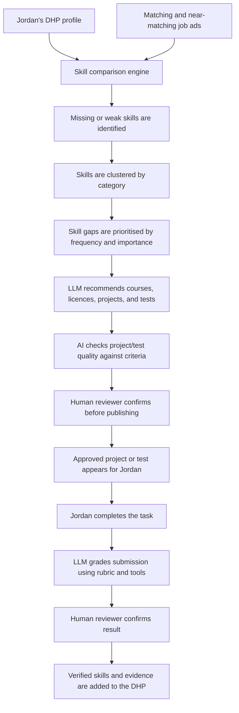
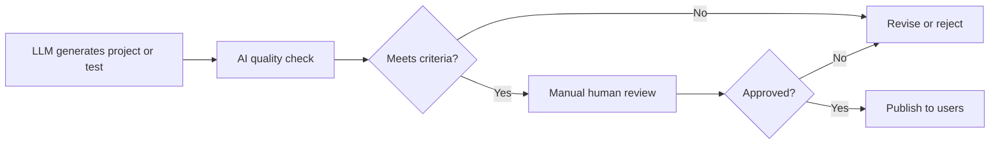
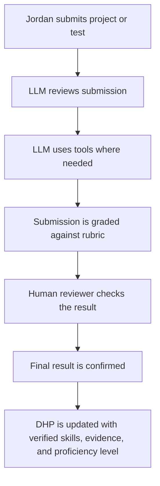

# Track 3 - AI: Task 1

## AI Feature: Skills Gap and Project Pathway Builder

### 1. Feature overview

I would design an AI-powered feature that helps graduates like Jordan understand what skills, projects, courses, licences, or practical tests they need for the jobs they want.

Jordan has a communications degree, casual hospitality experience, and wants to move into marketing or content roles. He has applied for many jobs but has received very little response. This feature would make his Digital Human Profile (DHP) more useful by showing him the gap between his current profile and the requirements of roles that match, or almost match, his goals.

The feature would not just say "you need more experience." It would identify the exact skills Jordan is missing, prioritise them, and recommend practical ways to build evidence for those skills inside his DHP.

---

### 2. What the feature does

The feature compares three main things:

| Input | Purpose |
|---|---|
| Jordan's DHP data | Understand his education, work experience, projects, skills, goals, and evidence |
| Matching job applications | Understand what entry-level marketing, content, and communications roles are asking for |
| Skill and evidence requirements | Find which skills Jordan already has and which skills he still needs to prove |

After comparing this data, the AI recommends:

- Skills Jordan should improve
- Courses or licences that could help him become more qualified
- Projects or tasks he can complete to build evidence
- Custom tests or challenges that can verify his skills
- Which gaps matter most for the jobs he wants

For example, if many content assistant roles ask for social media scheduling, campaign reporting, and copywriting, but Jordan's DHP only shows general communication skills, the system could recommend:

- A short social media analytics course
- A portfolio task where Jordan creates a campaign plan
- A writing test where Jordan produces content for a target audience
- A DHP evidence section showing the completed project and assessed skills

---

### 3. How it works at a high level

The process would work in four main stages.

### Stage 1: Compare Jordan's DHP with job requirements

The system would use Jordan's DHP data, such as:

- Education
- Work experience
- Skills
- Projects
- Career goals
- Uploaded evidence
- Preferred roles

It would compare this information with real or sample job ads that match Jordan's goals, such as:

- Marketing Assistant
- Content Coordinator
- Communications Assistant
- Social Media Assistant
- Graduate Marketing role

The AI would extract the skills, tools, licences, and evidence requested by those jobs. It would then compare them with Jordan's current DHP.

---

### Stage 2: Cluster and prioritise missing skills

The missing skills would be grouped into clusters so the output is easier to understand.

| Skill cluster | Example gaps for Jordan |
|---|---|
| Content creation | Copywriting, editing, writing for different audiences |
| Marketing tools | Canva, scheduling tools, analytics dashboards, email tools |
| Campaign thinking | Planning a campaign, measuring results, audience targeting |
| Portfolio evidence | Writing samples, campaign examples, project case studies |
| Professional readiness | Interview preparation, workplace communication, role-specific confidence |

The system would then prioritise each skill gap based on:

- How often the skill appears in matching jobs
- How important the skill is for the role
- Whether Jordan already has partial evidence for it
- How quickly Jordan could build proof of the skill

This makes the recommendation specific. Instead of telling Jordan to "improve marketing skills," the DHP could say:

> "Copywriting and campaign reporting appear frequently in roles close to your goal. You have communication experience, but your DHP does not yet show direct evidence of these skills."

---

### Stage 3: LLM recommends courses, licences, projects, and custom tests

The prioritised skill gaps would be sent to an LLM. The LLM's job would be to evaluate the gaps and recommend the best way for Jordan to build evidence.

The recommendations could include:

- A course
- A licence or certification
- A portfolio project
- A practical task
- A custom skill test created by the AI

Projects and tests are important because one task can prove multiple skills at once.

For example:

| Custom project or test | Skills it could prove |
|---|---|
| Create a 2-week social media campaign plan for a student event | Content planning, audience targeting, creativity, communication |
| Write three short posts for different audiences | Copywriting, tone control, audience awareness |
| Review campaign results and write a short insight report | Data interpretation, marketing analytics, written communication |
| Create a basic content calendar | Organisation, planning, digital marketing awareness |

This would help Jordan build practical evidence instead of only listing skills.

---

### Stage 4: Quality checking before users receive projects or tests

The AI should not be allowed to publish its own projects or tests directly to users. Any AI-generated project, task, or test would go through a two-stage checking process before it appears in the DHP.

The first check would be done by an LLM. It would check whether the project or test:

- Matches the skill gap
- Has clear instructions
- Has a realistic difficulty level
- Has a clear rubric
- Has required submission files
- Can be assessed fairly
- Does not ask for unsafe, irrelevant, or impossible work

The second check would be done manually by a real person, such as a developer, product team member, or trained reviewer. This human review is important because the project affects a user's profile, confidence, and career pathway.

Only verified projects and tests would be shown to users.

---

### 4. How user submissions are assessed

Once Jordan completes a project or test, his submission would also go through a two-stage review.

The LLM would read the submission and assess it against the project criteria and rubric. If needed, it could use tools to inspect files, check links, review written work, or compare the submission against the required format.

Then a human reviewer would confirm the result. This reduces the risk of unfair grading, hallucinated feedback, or incorrect skill certification.

If Jordan passes, the DHP could show:

- The completed project
- The skills demonstrated
- The proficiency level
- The rubric result
- A short evidence summary
- Any certificate or verified badge attached to the skill

---

### 5. Data the feature needs

| Data needed | Why it is needed |
|---|---|
| User profile data | To understand Jordan's background, goals, education, and work experience |
| Skills data | To compare current skills with role requirements |
| Project and evidence data | To know what Jordan has already proven |
| Job application data | To extract required skills from matching and near-matching jobs |
| Course and licence data | To recommend useful learning pathways |
| Project/test criteria | To create fair tasks with clear requirements |
| Rubrics | To assess submissions consistently |
| Submission files | To review completed projects and tests |
| Review history | To track AI and human approval decisions |
| Consent and visibility settings | To control what appears publicly on the DHP |

The system should keep raw user data private and only add approved evidence to the public DHP.

---

### 6. Outcome for Jordan

The outcome is that Jordan gets a clear pathway from:

> "I want this kind of job"

to:

> "These are the skills I need, these are the projects or tests I can complete, and this is the evidence my DHP can show employers."

For Jordan, this makes the DHP more useful because it becomes an active career-building tool, not just a profile page. It helps him understand why he may not be getting responses, what he can improve, and how to prove his capability.

For employers, it creates a more trustworthy profile. Instead of seeing unsupported skill claims, they can see verified projects, completed tasks, assessment results, and evidence linked to specific role-relevant skills.

---

### 7. Risks and guardrails

| Risk | Guardrail |
|---|---|
| The AI recommends irrelevant skills | Use real matching job data and explain why each skill was selected |
| The AI creates poor-quality projects or tests | Require AI quality checking and human approval before publishing |
| The AI grades unfairly | Use clear rubrics and human confirmation |
| Users receive too many recommendations | Cluster and prioritise skill gaps so the next steps are manageable |
| Sensitive data is exposed | Keep raw profile data private and require consent before showing evidence |
| Certificates become meaningless | Only issue verified skills after assessed submissions and review |

The feature should support Jordan without making career decisions for him. The AI can recommend, generate, and assess, but humans should remain involved where quality, fairness, and verification matter.
