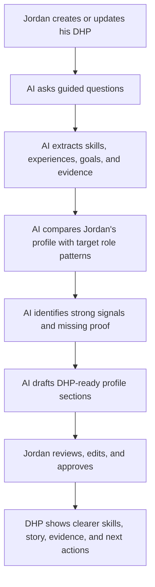
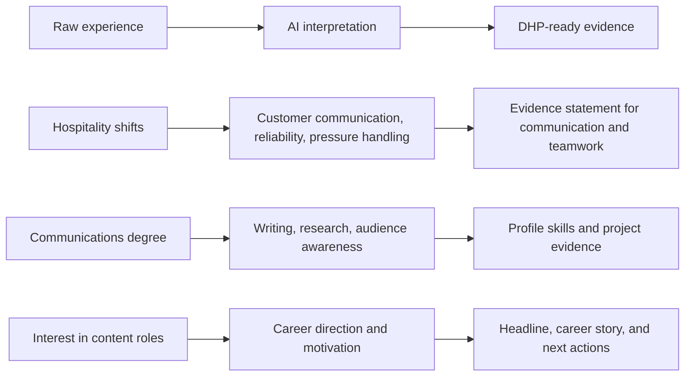

# Track 3 - AI: Task 1

## AI Feature: DHP Evidence Coach

### 1. Feature overview

The AI feature I would design is a **DHP Evidence Coach**.

Its purpose is to help graduates like Jordan turn their real experiences into a stronger Digital Human Profile (DHP). Jordan has a communications degree, casual hospitality experience, and a goal of moving into marketing or content roles. On a normal resume, his experience may look unrelated or too light. In a DHP, those same experiences can show communication, customer insight, teamwork, reliability, writing ability, adaptability, and creative potential.

The DHP Evidence Coach helps Jordan answer the question:

> "What have I actually done that proves I could succeed in the roles I want?"

Instead of only asking Jordan to list skills, the AI asks guided questions, extracts transferable skills from his answers, connects those skills to evidence, and suggests practical next steps to strengthen weak areas of the DHP.

This is not just a generic recommendation engine. It is a structured AI assistant that converts messy personal experience into DHP-ready evidence.

---

### 2. The problem it solves for Jordan

Jordan has applied for 40+ roles and only received three rejections. His problem is not only that he needs more applications. His problem is that employers may not be seeing his potential.

The gap is between:

| What Jordan has | What employers need to see |
|---|---|
| Communications degree | Writing, research, audience understanding, content strategy |
| Hospitality shifts | Customer empathy, pressure handling, teamwork, reliability |
| Interest in marketing/content roles | Motivation, direction, portfolio evidence |
| Rejected applications | Clearer positioning and proof of fit |
| Feeling invisible | A DHP that makes his story, skills, and evidence visible |

The DHP Evidence Coach helps close this gap by identifying the value hidden inside Jordan's existing experience and showing him what evidence he still needs to add.

---

### 3. How the feature works

At a high level, the feature has five steps.

**Step 1: Guided intake**

The AI asks Jordan simple questions about his background, such as:

- What kind of marketing or content work interests you?
- What university projects are you proud of?
- What did you do in hospitality that involved communication, problem solving, or working under pressure?
- Have you written, designed, posted, researched, presented, or organised anything?
- Do you have links, files, examples, assignments, campaigns, posts, or presentations that could be used as evidence?

The tone should feel supportive, not like a formal job application.

**Step 2: Skill and evidence extraction**

The AI reads Jordan's answers and extracts possible DHP signals, such as:

- Writing and communication
- Customer empathy
- Audience awareness
- Research
- Teamwork
- Reliability
- Problem solving
- Presentation skills
- Content planning
- Social media familiarity

Each skill is linked to evidence where possible. For example, hospitality work should not become a vague claim like "good communication." It should become something more specific, such as:

> "Handled customer questions during busy service periods, showing clear communication, patience, and ability to work under pressure."

**Step 3: Role comparison**

The system compares Jordan's current DHP signals with common requirements from entry-level marketing, communications, and content roles.

For example, it might compare him against role patterns like:

- Marketing Assistant
- Content Coordinator
- Social Media Assistant
- Communications Assistant
- Graduate Marketing role

The AI looks for both matches and gaps.

**Step 4: DHP content generation**

The AI drafts DHP-ready content that Jordan can review before publishing. This could include:

- A profile headline
- A short personal story
- Skill statements
- Evidence summaries
- Suggested portfolio items
- Missing information prompts
- Next best actions

The AI should never publish automatically. Jordan stays in control and approves what appears on the DHP.

**Step 5: Next action pathway**

The feature recommends practical actions that help Jordan improve the DHP, such as:

- Upload a university campaign or writing assignment
- Write a short case study about a content idea
- Add a link to a simple portfolio
- Create one sample social media campaign for a real or fictional brand
- Add evidence of teamwork, presentation, or customer-facing communication
- Complete a short course only if it fills a clear gap

---

### 4. Data the feature needs

| Data needed | Why it matters | Example |
|---|---|---|
| Basic profile data | Personalises the DHP content | Name, location, degree, target roles |
| Education history | Finds academic evidence | Bachelor of Communications at UTS |
| Work experience | Extracts transferable skills | Casual hospitality shifts |
| Projects and assignments | Builds proof of capability | Campaign plan, presentation, article, research report |
| Career goals | Keeps output relevant | Marketing Assistant, Content Coordinator |
| Target role patterns | Compares Jordan with real expectations | Common skills from entry-level marketing job ads |
| Uploaded evidence | Lets claims be supported by proof | PDFs, links, images, writing samples |
| User consent settings | Protects privacy and control | What can be shown publicly or to employers |

The system should separate **private raw information** from **approved public DHP content**. Jordan may share details with the AI to get help, but he should choose what appears on his profile.

---

### 5. Example output for Jordan

Example DHP draft section:

| DHP section | AI-generated draft |
|---|---|
| Headline | Communications graduate interested in marketing, content, and community storytelling |
| Strength | Clear communicator with customer-facing experience and a strong interest in audience-focused content |
| Evidence | Completed communications coursework involving research, writing, and presentations |
| Transferable skill | Hospitality experience showing teamwork, reliability, and communication under pressure |
| Suggested next action | Upload one writing sample and create a short marketing campaign case study |

---

### 6. Why this is useful for the DHP

The DHP is meant to show more than a resume. This feature supports that goal because it helps Jordan show:

- **Story:** why he is interested in marketing and content
- **Skills:** what he can actually do
- **Evidence:** where those skills have appeared in real work, study, or projects
- **Potential:** how his hospitality and university experience can transfer into a new field
- **Next steps:** what he can add to become more visible to employers

For Jordan, the outcome is a DHP that feels less empty and more human. Instead of seeing himself as someone with "only hospitality experience," he can see a profile that explains his communication strengths, career direction, and evidence of capability.

For employers, the outcome is a clearer signal of Jordan's fit for early-career marketing and content roles. They can see not only what he studied, but how his experience, values, projects, and potential connect to the role.

---

### 7. AI safety and quality checks

Because this feature affects how a person is represented to employers, it needs guardrails.

| Risk | Guardrail |
|---|---|
| AI exaggerates Jordan's experience | Every generated claim must be linked to evidence or marked as a suggestion |
| AI creates generic profile text | Use Jordan's actual inputs, target roles, and examples |
| Sensitive data is exposed | Keep raw intake private and require approval before publishing |
| Bias in role matching | Use transparent skill categories and let Jordan edit career goals |
| Jordan loses control of his story | The AI drafts, but Jordan reviews and approves |

The best version of this feature would feel like a coach, not a judge. It should help Jordan recognise and explain his value while keeping him in control of the final DHP.

---

### 8. Success measure

I would measure whether the DHP Evidence Coach works by checking:

- Does Jordan complete more of his DHP after using it?
- Does his profile include stronger evidence, not just skill labels?
- Does he understand what to add next?
- Are the generated statements accurate and approved by Jordan?
- Do employers get a clearer picture of his potential?

The feature is successful if Jordan leaves with a DHP that is clearer, more evidence-based, and more confident than what he could have built from a blank form.
