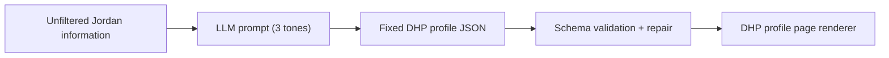
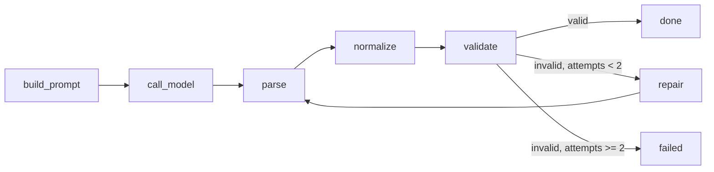

# Track 3 - AI: Task 2 — Write and test a prompt

> **Task:** Write a prompt that helps a graduate like Jordan articulate their skills and experience in a way that would be useful for their DHP™. Run it using an AI tool, share the prompt and a sample output, and annotate what works, what does not, and how I would iterate.

## TL;DR

- **The prompt** turns Jordan's raw, messy notes into **one page-ready DHP profile JSON object** that follows a fixed JSON Schema, so a frontend can render it without parsing free text.
- I tested **three prompt variations** (different tones, same structure) across **two models** (Gemini Flash and Gemini Flash-Lite) = **6 generated DHP pages**.
- The orchestration uses **LangGraph + LangChain**, with **JSON Schema validation** and an automatic **repair loop** before any output is accepted.
- **Easiest way to see the results:** open the live demo and click through the six generated pages.

  **→ [https://gradstack-track-3-task-2-prompts.vercel.app/](https://gradstack-track-3-task-2-prompts.vercel.app/)**

## Why a JSON prompt (not a paragraph)

A DHP is a structured product page, not a cover letter. So the prompt is designed so the LLM does **not** write a free-form paragraph. It must output the **same JSON structure every time**, which the frontend then uses to recreate the DHP profile page.



This keeps the DHP distinct from a resume: instead of only education and work history, the output carries Jordan's story, transferable skills, evidence, trust signals, verified indexes (VEI/VCI), and role-match guidance.

## The prompt

Every run shares one **system prompt** and one **user prompt template**, defined in `scripts/run_prompt_eval.py` (`build_prompt_node`). Only the **tone instruction** changes between the three variations.

### System prompt

```
You are an AI assistant helping Gradstack transform raw graduate information
into one page-ready Digital Human Profile JSON object. Preserve the same page
contract, density, IDs, and DHP product language as the canonical reference page.
Return only valid JSON. Do not include markdown, comments, or code fences.
```

### User prompt template

The user prompt injects four things: the **tone instruction**, the **canonical DHP reference page** (display contract / style benchmark), a set of **hard rules**, the **JSON Schema**, and the **raw input** about Jordan.

```
Transform the raw input into one JSON object that strictly follows this JSON Schema.

Tone requirement:
{tone_instruction}

Canonical DHP page reference:
Use this JSON as the display contract and style benchmark for the generated page...
{canonical_reference_json}

Hard rules:
- Output only JSON.
- Use schemaVersion "dhp-profile-page.v1".
- Do not invent qualifications, employers, certificates, or verified evidence.
- Mark unverified details as pending, suggested, or needs evidence.
- Scores must be integers from 0 to 100.
- Confidence values must be integers from 1 to 5.
- Use stable kebab-case IDs.
- Keep display strings concise enough for a DHP page.
- Keep the five DHP rail labels exactly: Story, Skill, Proof, Trust, Index.
- Keep the VEI and VCI index links as short product links...
- Keep the capability match panel focused on the three raw job ads...
- Keep the VCI as the five-layer DHP capability model, including AI Literacy & Fluency.
- Keep the same section density as the reference page...
- Tone can change wording, but it must not change the page structure or turn the DHP into a generic CV.

JSON Schema:
{schema}

Raw input:
{raw_input}
```

### The three prompts (tone variations)

The only difference between the three runs is the `tone_instruction` value:

| # | Prompt (tone) | Tone instruction | Intended use |
|---|---|---|---|
| 1 | **Supportive coach** | *"Write in a supportive coaching tone. Help Jordan feel seen while staying precise, professional, and evidence-based."* | Graduate-facing, confidence-building |
| 2 | **Employer-ready** | *"Write in a concise employer-facing tone. Prioritise proof, trust, role fit, and clear signals that a hiring team could scan quickly."* | Employer/recruiter view |
| 3 | **Product-structured** | *"Write in a product-system tone. Make the sections consistent, structured, and ready for a frontend renderer to display without extra interpretation."* | Default product rendering |

## Sample output

All six generated pages live in `data/generated/outputs/`. The structure is identical across runs (same keys, IDs, and density); the **wording** changes with tone. The clearest illustration is the `dhpView.personalStory` field for Gemini Flash:

**Supportive coach** (speaks to Jordan directly, acknowledges the emotional context):
> "Jordan, it's clear you're navigating a significant transition from university life to your career aspirations, and it's completely understandable to feel invisible after many applications. You've built a strong foundation with your Bachelor of Communications from UTS... your DHP is here to help you showcase that potential and connect with the right opportunities."

**Employer-ready** (third person, scannable, proof-first):
> "Jordan Lee is an enthusiastic Bachelor of Communications graduate from UTS, seeking an entry-level content or marketing role. With 18 months of post-graduation experience, Jordan has developed strong customer communication skills in hospitality and proven writing abilities through academic projects and a portfolio writing sample."

**Product-structured** (neutral, consistent, render-ready):
> "Jordan Lee is a 24-year-old Bachelor of Communications graduate from UTS, eager to launch a career in content or marketing. Currently gaining valuable customer communication skills in hospitality, Jordan is actively seeking an entry-level role to apply proven writing, audience awareness, and project thinking."

A trimmed look at the shared structure (from `gemini-flash.employer-ready.json`):

```json
{
  "schemaVersion": "dhp-profile-page.v1",
  "user": { "fullName": "Jordan Lee", "initials": "JL", "location": "Sydney, NSW" },
  "profileHeader": {
    "railLabels": ["Story", "Skill", "Proof", "Trust", "Index"],
    "headline": "Entry-level Content & Marketing Professional | Customer-Focused | Proven Writing Skills",
    "readinessScore": 74,
    "indexLinks": [
      { "id": "vei", "label": "VEI", "score": 78, "targetPage": "opportunities", "tone": "ready" },
      { "id": "vci", "label": "VCI", "score": 73, "targetPage": "vci", "tone": "proof" }
    ]
  },
  "dhpView": { "personalStory": "...", "insightCards": [], "skillsWithEvidence": [], "trustAndConsent": [] },
  "resumeView": { "education": [], "experiences": [], "projects": [], "applications": [] },
  "matchPanel": { "opportunities": [] },
  "indexes": { "verifiedEmployabilityIndex": {}, "verifiedCapabilityIndex": {}, "readinessSignals": [] }
}
```

## Results

All six runs passed schema validation. Source of truth: `data/generated/manifest.json` and `data/generated/metrics/`.

| Model | Prompt | Schema valid | Attempts | Total tokens | Latency |
|---|---|---|---|---|---|
| Gemini Flash | Employer-ready | ✅ | 1 | 11,844 | ~34.5s |
| Gemini Flash | Product-structured | ✅ | 2 (1 repair) | 19,809 | ~38.8s + 17.5s repair |
| Gemini Flash | Supportive coach | ✅ | 2 (1 repair) | 21,397 | ~44.1s + 28.8s repair |
| Gemini Flash-Lite | Supportive coach | ✅ | 1 | 8,151 | ~38.3s |
| Gemini Flash-Lite | Employer-ready | ✅ | 1 | 7,417 | ~30.6s |
| Gemini Flash-Lite | Product-structured | ✅ | 1 | 7,942 | ~34.7s |

Observations:

- **Gemini Flash** produced richer, more detailed prose but needed the **repair loop** twice to land on schema-valid JSON. **Gemini Flash-Lite** validated first time on every run and used roughly half the tokens.
- A **normalization step** re-aligns a few display-contract fields (rail labels, index links, match-panel opportunities) to the canonical page so tone changes never drift the page structure or rename employers.

## What works / what doesn't / how I'd iterate

### What works
- The **fixed JSON contract** makes output predictable. The frontend reads stable keys (`profileHeader`, `dhpView`, `resumeView`, `matchPanel`, `indexes`) instead of parsing prose.
- The DHP stays **different from a resume** — it includes story, transferable skills, evidence, trust signals, and role-match guidance.
- **Tone is decoupled from structure.** Swapping one instruction changes voice for graduate vs employer vs renderer without breaking the page.
- **Schema validation + repair** means the frontend only ever receives page-ready JSON.

### What doesn't work yet
- Output quality still depends on the **quality of the raw input**. Thin input leads to weak evidence statements or over-generalised skills.
- The VEI/VCI and match **scores are mock values** carried from the prototype, not a real scoring model.
- **Gemini Flash sometimes needs a repair pass**, adding latency and tokens — the single-prompt approach isn't 100% reliable on the first try for larger models.

### How I would iterate
- Connect the prompt to **real job ads**, a stronger **skills taxonomy**, and a defensible **scoring model** before showing VEI/VCI/match numbers in production.
- Adopt **structured output / function-calling** (native JSON mode) to reduce reliance on the repair loop.
- Add a **content-quality check** (not just schema validity) — e.g. flag unverified claims and require evidence links before a section is marked "ready".

## How to run it

### Easiest: just view the live demo

**→ [https://gradstack-track-3-task-2-prompts.vercel.app/](https://gradstack-track-3-task-2-prompts.vercel.app/)**

The deployed site reads the committed `data/generated/manifest.json` and shows a navigator to switch between the six generated DHP pages (Gemini Flash and Gemini Flash-Lite × three tones). No setup required.

### View the generated pages locally

The page loads JSON files via `fetch`, so serve the folder over HTTP (don't open `index.html` from disk):

```bash
python -m http.server 8010
```

Then open `http://localhost:8010`.

### Re-generate the outputs yourself

1. Install dependencies:

```bash
pip install -r scripts/requirements.txt
```

2. Copy `.env.example` to `.env` and add your key:

```bash
GOOGLE_API_KEY=...
```

3. Run the evaluator from this folder:

```bash
python scripts/run_prompt_eval.py
```

It writes outputs to `data/generated/outputs/`, metrics to `data/generated/metrics/`, and `data/generated/manifest.json`.

#### Useful flags

```bash
# Preview the layout without any API calls (clearly marked as dry-run)
python scripts/run_prompt_eval.py --dry-run

# Re-run a single model/tone combination
python scripts/run_prompt_eval.py --provider gemini-flash --tone supportive-coach
```

#### Model configuration

This version uses two Gemini families suitable for Google AI Studio free-tier testing (subject to your account's quota). Adjust in `.env` if your account shows different model IDs:

```bash
GEMINI_FLASH_MODEL=gemini-flash-latest
GEMINI_FLASH_DISPLAY_NAME=Gemini Flash

GEMINI_FLASH_LITE_MODEL=gemini-flash-lite-latest
GEMINI_FLASH_LITE_DISPLAY_NAME=Gemini Flash-Lite
```

## How it works under the hood

The runner uses **LangGraph** to orchestrate a small state machine, calling Gemini through **LangChain**:



- **build_prompt** — assembles system + user prompt from the raw input, schema, canonical reference, and tone.
- **call_model** — invokes Gemini, records token usage and latency.
- **parse** — extracts the JSON object (tolerates stray fences/text).
- **normalize** — re-aligns display-contract fields with the canonical DHP page.
- **validate** — runs Draft 2020-12 JSON Schema validation.
- **repair** — on validation failure, feeds the errors back to the model (up to 2 attempts total).

## Files

| File | Purpose |
|---|---|
| `index.html` | DHP profile page shell (web app entry point) |
| `app.js` | Loads the manifest + generated JSON and renders each DHP page with a run navigator |
| `styles.css` | Styling for the JSON-rendered DHP page |
| `scripts/run_prompt_eval.py` | LangGraph/LangChain prompt evaluation runner (defines the system prompt, user prompt, and three tones) |
| `scripts/requirements.txt` | Python dependencies for the evaluator |
| `.env.example` | Environment variable template for API keys and model IDs |
| `data/raw/jordan-unfiltered-input.json` | Raw, messy source info about Jordan (situation, skills, evidence, verification, job ads, page requirements) |
| `data/schema/dhp-profile-page.schema.json` | Fixed JSON contract the LLM must follow |
| `data/reference/dhp-profile-page.reference.json` | Canonical DHP reference used to keep generated pages aligned with the Track 2 prototype |
| `data/generated/outputs/` | The six generated DHP JSON pages |
| `data/generated/metrics/` | Per-run metrics (schema validity, attempts, tokens, latency) |
| `data/generated/manifest.json` | Index of all runs that the website reads |

## What the JSON recreates

The output JSON rebuilds the DHP profile page from `track-2-development/task-2-build-a-component-or-prototype/`, including:

- profile header
- Story / Skill / Proof / Trust / Index rail
- DHP view and Resume view
- skills with evidence
- trust and consent section
- capability match panel
- VEI and VCI score cards
- role-match recommendations
