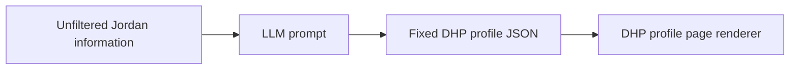

# Track 3 - AI: Task 2

## Goal

This task reverse engineers the Track 2 DHP profile prototype into an AI workflow.

The idea is:



The LLM should not create a random paragraph response. It should output the same JSON structure every time, so the frontend can use that JSON to recreate the DHP profile page.

## Run the generated DHP pages

Because the page loads generated JSON files, run it through a local server from this folder:

```bash
python -m http.server 8010
```

Then open:

`http://localhost:8010`

## Run the LangGraph prompt comparison

Install the Python dependencies:

```bash
pip install -r requirements.txt
```

Copy `.env.example` to `.env`, then add your API keys:

```bash
GOOGLE_API_KEY=...
```

Then run:

```bash
python run_prompt_eval.py
```

The runner uses:

- LangGraph to orchestrate prompt build, model call, JSON parsing, schema validation, and repair
- LangChain to call Gemini models
- JSON Schema validation before writing any model output to the website

It writes generated outputs to:

- `data/generated/outputs/`
- `data/generated/metrics/`
- `data/generated/manifest.json`

The website reads `data/generated/manifest.json` and shows a top navigation panel for switching between the Gemini Flash and Gemini Flash-Lite outputs. Each model has three generated DHP pages, one for each prompt tone, and the page renders one selected DHP at a time.

### Model names

This version does not use ChatGPT or OpenAI API models. It compares two Gemini model families that are suitable for Google AI Studio free-tier testing, subject to your account's current quota.

```bash
GEMINI_FLASH_MODEL=gemini-flash-latest
GEMINI_FLASH_DISPLAY_NAME=Gemini Flash

GEMINI_FLASH_LITE_MODEL=gemini-flash-lite-latest
GEMINI_FLASH_LITE_DISPLAY_NAME=Gemini Flash-Lite
```

You can change these in `.env` if Google AI Studio shows different model IDs for your account.

### Dry run

To test the website layout without API calls:

```bash
python run_prompt_eval.py --dry-run
```

Dry-run outputs are clearly marked in the metrics and should not be presented as real LLM results.

## Files

| File | Purpose |
|---|---|
| `index.html` | DHP profile page shell |
| `app.js` | Loads the final JSON and renders the DHP profile page |
| `styles.css` | Styling for the JSON-rendered DHP page |
| `run_prompt_eval.py` | LangGraph/LangChain prompt evaluation runner |
| `requirements.txt` | Python dependencies for the prompt evaluator |
| `.env.example` | Environment variable template for API keys and model IDs |
| `data/raw/jordan-unfiltered-input.json` | Raw, messy source information about Jordan, jobs, evidence, verification, and page requirements |
| `data/schema/dhp-profile-page.schema.json` | Fixed JSON contract the LLM must follow |
| `data/reference/dhp-profile-page.reference.json` | Canonical DHP reference used by the evaluator to keep generated pages aligned with the prototype |
| `data/generated/` | Real or dry-run model outputs and metrics generated by `run_prompt_eval.py` |

## What the JSON recreates

The output JSON is based on the DHP profile page in:

`track-2-development/task-2-build-a-component-or-prototype/`

It includes the content needed to rebuild:

- the profile header
- story, skill, proof, trust, and index rail
- DHP view
- resume view
- skills with evidence
- trust and consent section
- capability match panel
- VEI and VCI score cards
- role match recommendations

## Prompt test

The evaluator builds the prompt in `run_prompt_eval.py`, using the raw JSON, schema, and canonical DHP reference.

### What works

The fixed JSON format makes the output predictable. A frontend does not need to parse a long text response; it can read stable keys such as `profileHeader`, `dhpView`, `resumeView`, `matchPanel`, and `indexes`.

It also keeps the DHP different from a resume. The output includes Jordan's story, transferable skills, evidence, trust signals, and role match guidance instead of only education and work history.

### What does not work yet

The generated result still depends on the quality of the raw information. If the raw input is incomplete, the LLM may produce weak evidence statements or over-generalise Jordan's skills.

The scores in the sample are mock values from the prototype. A real product would need a clearer scoring model, job data source, and review process before using VEI, VCI, or match scores in production.

### How I would iterate

Next, I would connect the prompt to real job ads, a stronger skills taxonomy, and a validation step. I would also test the output against a JSON Schema validator before accepting it, so the frontend only receives page-ready JSON.

The page in this folder now reads `data/generated/manifest.json` and renders the selected generated JSON output as a DHP page.
